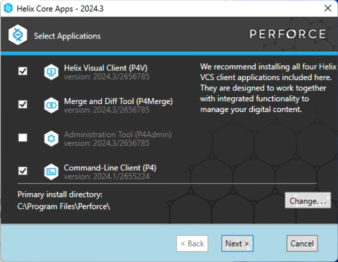
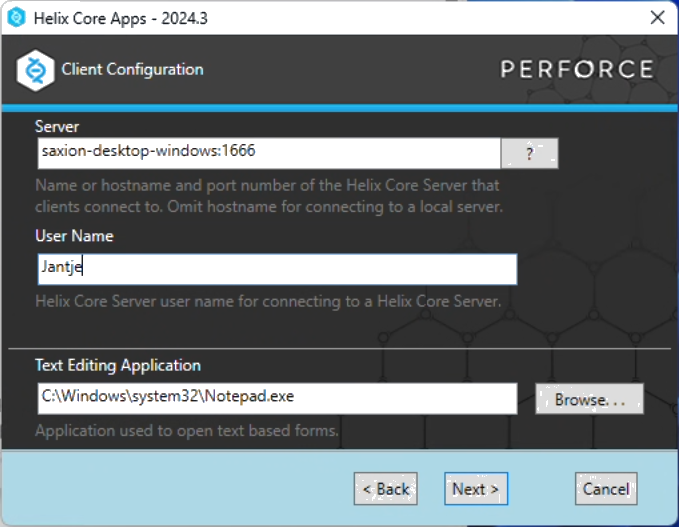
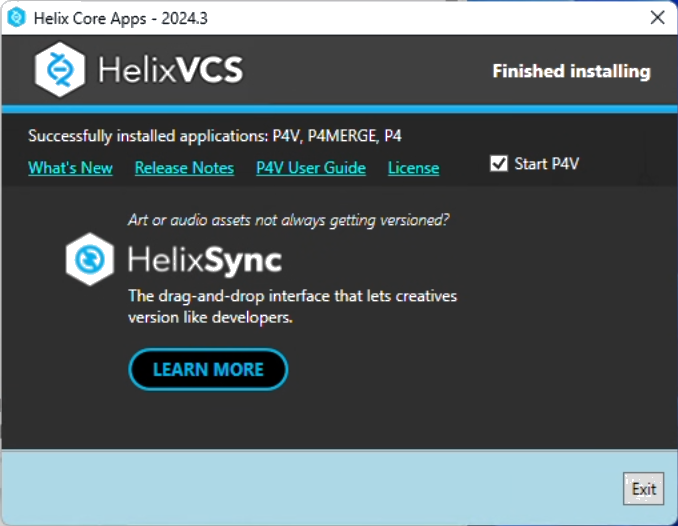
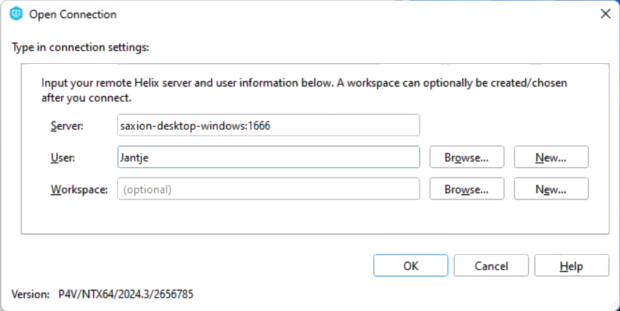
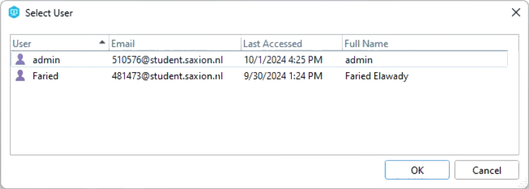
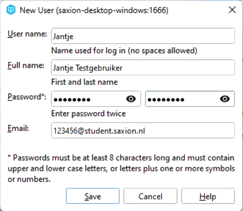
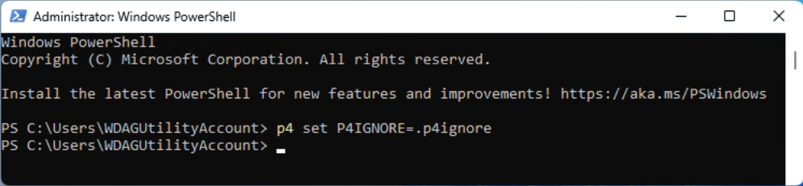
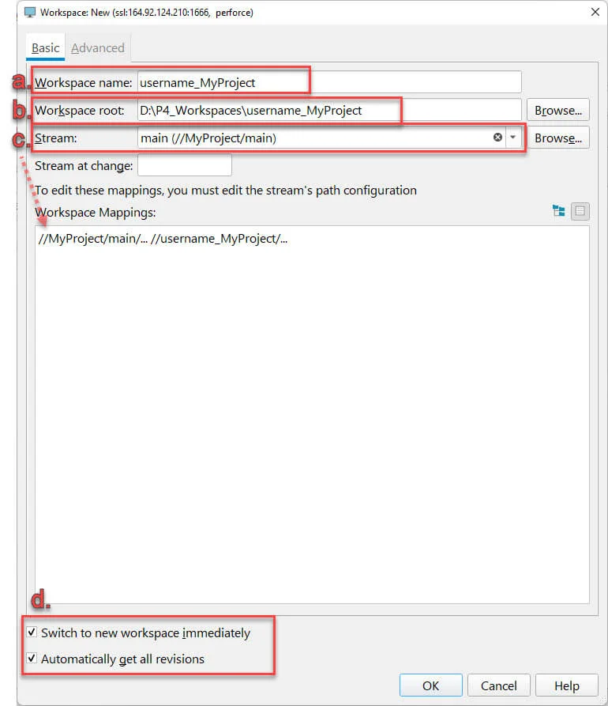

# Perforce Setup Guide for Users

## Computer name
Every computer has a name. This makes it recognisable in lists with many computers.  
Please make sure that your computer name is recognisably yours.

You can check your computer name here:
1. In the Settings app on your Windows device, select **System** > **About**

If it's something like "COMPUTER-12AB3", please rename it like this:
1. Select **Rename this PC**
2. Enter a new recognisable name and select **Next**
3. Select **Restart now** or **Restart later**. Make sure you have done that restart BEFORE doing the next step (Tailscale)!!

## Tailscale
Tailscale is the program you will be using to connect to the server computer.
1. Download Tailscale from here: https://tailscale.com/download
2. Download and run the installer
3. In the system tray of your computer (bottom right), click the Tailscale icon, and authenticate in your browser.  
   (You may need to click the arrow Λ)
4. Log in via the team-shared Google account (the credentials are in our team-shared Notion)
5. Once you're logged in, you should see a web page with a list of the machines. You can now close the tab.
6. Right click the Tailscale icon in your system tray, and go to **Network devices** > **My Devices**
   and make sure you see `saxion-desktop-windows` in that list.
   (You don't have to click it. Just make sure it's there.)

## P4V
P4V is the program you will be using to check out files from the server,
and send them back to the server once you're done with them.
1. Download it from here: https://www.perforce.com/downloads/helix-visual-client-p4v
   (get the EXE version, not the MSI version) and run the downloaded executable
2. Make sure to install `P4V`, `P4Merge` and `P4`. You don't need `P4Admin`, though.  
   
3. In the **Server** field, fill in this: `saxion-desktop-windows:1666`.  
   This is a direct connection to the server computer at Saxion that Tailscale makes possible for us! :)  
   In the **User Name** field, fill in your first name, with a capital first letter.  
   You can set a different text editor here, if you like. I personally recommend [Notepad++](https://notepad-plus-plus.org/).  
   
4. Wait...  
   While it is installing, you can watch this video:
   https://www.youtube.com/watch?v=jIQEjDiSe0g  
   
5. Leave the checkbox in front of **Start P4V** enabled, and click **Exit**.
6. P4V will now open and show an **Open Connection** dialog.
   The **Server** and **User** should be the same as you filled in during the installation.  
   
7. You probably don't actually have an account yet.
   You can check that by clicking the **Browse** button next to the `User` field.  
   
8. You can click the **Cancel** button to close the new `Select User` window again.
9. Now click the **New** button next to the `User` field.
10. Fill in your full name, choose a strong password and use your Saxion email.  
   
11. If you check the **Browse** now, you should see your newly made account there.
12. Click **Ok**, and now the full P4V should open.
13. It will ask you if it may check for updates. I recommend saying **Yes**
14. It will also ask you if it can collect some anonymous usage statistics.
    I will not make a recommendation for what you should choose here.
15. You will now see two things in the **Depot** screen on the left.
    The legacy project is the files we got from the previous team,
    and the new project is the clean slate that we're starting from.
16. If you haven't, yet, please watch the video linked in step 3.
17. And here is a cheat-sheet for P4V that shows the most important buttons and icons:
    https://www.perforce.com/sites/default/files/pdfs/perforce-helix-cheatsheet.pdf
18. Now, close P4V.
19. Right click on the Windows start button, and select **Windows PowerShell**  (admin should not be necessary)
20. A black or blue screen with white text should now pop up. Do not be afraid.
21. Copy&paste this line into it:
    ```
    p4 set P4IGNORE=.p4ignore
    ```
22. And then press enter.  
    
23. You can close the PowerShell window again.

P4V has now been installed! :D

## Setting up your Workspace
In order to actually work on files in Helix Core, you need to create a workspace.
A workspace is a folder on your local machine that is linked to files on the server.  
Using this workspace, you can add new files to the server, edit existing files,
get the latest changes from others, or go back to previous versions of files.

### Creating workspace
1. Open P4V again
2. Open the **Stream Graph** panel in the right panel
3. Select the depot of the project you want to work on
4. Right click on the `main` stream and select **New Workspace…**


### Workspace name & root
  
**a.** By default, the workspace name follows the format of:
- your Perforce username
- the name of your machine (that you verified, or maybe even changed, earlier)
- the name of the stream that you started this from
- an ID number

Remove that, and fill in your **(user)name**, an **underscore**, and then the **project name**.  
If you are intending to work on the project from multiple computers, please add the name of your computer there, as well.

The workspace name is stored on the server, so other users can see your workspace name.  
We want to be sure that everyone knows whose workspace is whose, so that's why we put the (user)name (and computer name) there.

**b.** Choose a place on your computer where you want to store the workspace (all the project files).  
As a best practice, the workspace root folder should be the same as the workspace name, so copy&paste the name to the root.

**c.** Verify that the Stream is the correct one.

**d.** Check the **Switch to New Workspace** and **Automatically get all revisions** options at the bottom.  
DO _NOT_ CLICK **OK** JUST YET

### Workspace Advanced Tab
  
Click the `Advanced` tab, on the top of the window.
**a.** You can fill in a description if you want.

**b.** Under **File Options**, enable the "remove directory" (`Rmdir`) option,
so that empty workspace directories will get deleted when they're empty.  
This helps keep your workspace clean.

**c.** The **On Submit** option is on **Submit all selected files** by default.
This means is that if you, for example, check out a whole folder of 20 files and work on just two of them.  
Once you are done and submit your changes, all 20 of those files are going to get submitted to the server and will have a new revision.  
They'll look like there's been a change to them, even though you didn't actually change anything in any of them, except for those two.

The "Don't submit unchanged files" option would make it so it would just submit those two files you changed,
and it would keep those other 18 checked out. This is probably also not what we want.  
So we use the "Revert unchanged files" option, as that makes it so it only submits those two files you changed,
and then it would just revert (un-checkout) all those other files when you submit it.  
This helps make sure you're not leaving files checked out that you didn't need to.

So set the **On Submit** option to **Revert unchanged files**, so that you don’t waste time and space uploading new versions of files that haven’t changed. 

**d.** If you’re not on Windows, please change the Line ending characters for text files option to Win.  
This will prevent compatibility issues between operating systems.

Now you can press OK.  
P4V will start downloading the project files to your computer. To the folder you selected earlier.

You can now open that project in UE5 at your leisure :)

## Actually working with Perforce
Watch this first: https://www.youtube.com/watch?v=b0oe8UYdm7s

And then watch this: https://www.youtube.com/watch?v=7PRo8gK6SNM  
↑ this video will also guide you through setting up Perforce inside Unreal Engine itself.

If you have any questions about working with Perforce and Helix Core and P4V, please don't hesitate to ask me!
